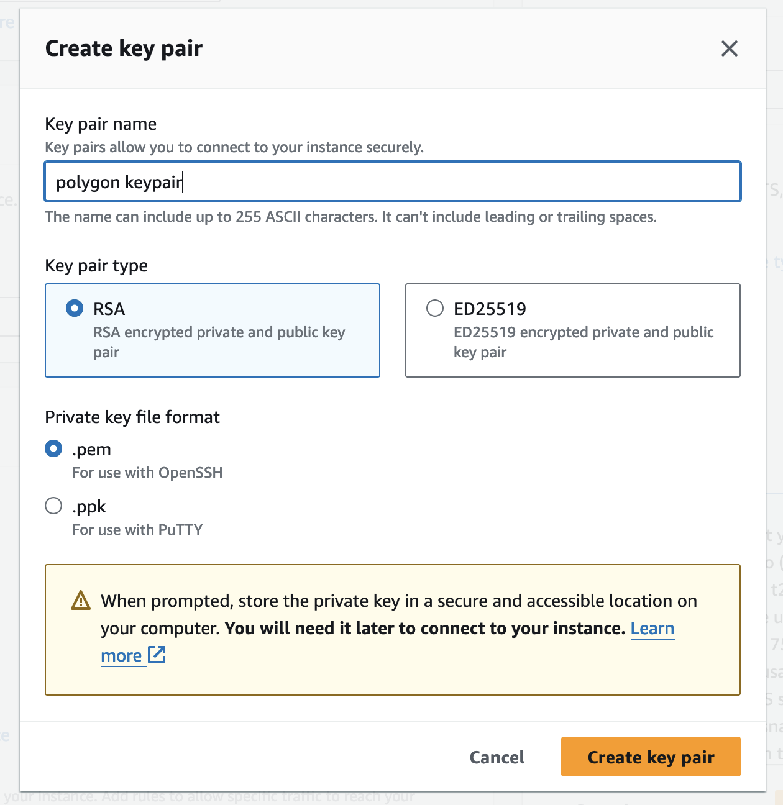

# Polygon's zkEVM Benchmarking

*Special thanks to Ignasi Ramos, Francesc Romero, Carlos Matallana and Héctor Masip for discussion and helping with technical issues.*

In this guide, we will set up a machine on Amazon Web Service (AWS), install Polygon's `zkevm-prover`, and produce proofs for arbitrary transactions.

Everything below has been tested on commit `d37e826111324dd5f266dc39e89fc610679f16c8` (release `v6.0.0`).

# Create an AWS Instance

The instance we used has these characteristics:

- **Machine type:** r6i.metal (128 vCPU, 1024 GiB RAM)
- **CPU Platform:** Intel(R) Xeon(R) Platinum 8375C CPU @ 2.90GHz (the CPU MUST support AVX2 instruction set)
- **Architecture:** x86_64
- **Boot disk space:** 1TB SSD
- **OS:** Ubuntu 22.04 LTS

At the time of writing, this machine costs 8.064 USD per hour. Note that there might be regions that are cheaper, or you can reduce the cost with reserved pricing.

## AWS Instructions

First, login into AWS and go to `Services` -> `Compute` -> `EC2`.
Next, we want to correctly configure and launch the machine.
Select the orange button `Launch Instance`, then you will need to select the proper OS and machine type.
In the following screenshot, we highlight the configurations you have to change (i.e., Ubuntu Server 22.04 LTS, 64-bit (x86), and r6i.metal:


Next, scroll down to the `Create Key Pair` section and either select an existing one or create a new one.
We will need that key to connect to the machine later. 
When you download the key say it to a file called `pol.pem`.



Finally, configure the storage as follows.


Now, you can launch the machine.

### Connect to the machine

To connect to the machine you have to go to your instances in AWS and find its public IPv4.
When you find it to connect run the following command:

```bash
# Remeber to replace the IP with yours
# Remember to change the perimissions of your key (i.e., chmod +400 pol.pem)
ssh -i pol.pem ubuntu@52.160.53.325
```

Then, when you connect to your machine, enable sudo access without a password.

```bash
sudo visudo
# Change the line 
# %sudo   ALL=(ALL:ALL) ALL
# to
# %sudo  ALL=(ALL) NOPASSWD: ALL
```

# Setup the Machine and Install Dependencies

Once you are logged in into the AWS machine, you should clone three different repositories on your home directory.

```bash
# Clone zkevm-prover repository
git clone --recursive https://github.com/0xPolygonHermez/zkevm-prover.git

# Clone zkevm-testvectors repository
git clone https://github.com/0xPolygonHermez/zkevm-testvectors.git

# Clone zkrollup-benchmarking
git clone https://github.com/StefanosChaliasos/zkrollup-benchmarking.git
```

## Setting up the Prover

```bash
cd zkevm-prover
# Checkout zkevm-prover release v6.0.0
git checkout d37e826111324dd5f266dc39e89fc610679f16c8

# Make sure that tools/download_archive.sh has 
# `ARCHIVE_NAME="v6.0.0-rc.1-fork.9" on line 8.
patch tools/download_archive.sh ../zkrollup-benchmarking/polygon_patches/download_archive.sh.patch

# Download necessary files (very large download ~75 GB, 
# and takes an additional 115 GB of space once extracted), 
# it's a good idea to download it now and have it running in the background:
./tools/download_archive.sh


# Install dependencies
sudo apt update -yqq
sudo apt install -yqq build-essential libbenchmark-dev libomp-dev libgmp-dev nlohmann-json3-dev postgresql libpqxx-dev libpqxx-doc nasm libsecp256k1-dev grpc-proto libsodium-dev libprotobuf-dev libssl-dev cmake libgrpc++-dev protobuf-compiler protobuf-compiler-grpc uuid-dev
```

### Compilation

You may first need to compile the protobufs:

```bash
cd src/grpc
make
cd ../..
```

Then, run `make` to compile the main project.
```bash
make clean
make generate
# Run '-j' argument to compile the project 
# using all the threads available of the CPU... it takes a while...
make -j
```

After this, you should have a binary `zkProver` under `build` directory inside `zkevm-prover`.

# Creating the first sample proof

## Setting up Prover parameters

We will be running the prover with a sample provided by Polygon's team.

To do that, we need to modify some files.

### Modify `config_runFile_e2e.json`

We need to do a minor update to `testvectors/config_runFile_e2e.json` file.
We can do that using the following command.

```bash
patch testvectors/config_runFile_e2e.json polygon_patches/config_runFile_e2e.json.patch
```

### Modify `aggregator_service.cpp`

We also need to apply some changes to `test/service/aggregator/aggregator_service.cpp` using the following command.

```bash
patch test/service/aggregator/aggregator_service.cpp polygon_patches/aggregator_service.cpp.patch
```

With these changes we are, basically, doing two main things:
1. Timing the time it takes to generate every proof.
2. Adding an option to only perform a batch proof when setting an environment variable `BENCH_BATCH`.
 
### Recompile the `zkProver`

After those changes, we need to recompile the binary of the `zkProver`:

```bash
make -j
```

### Producing and verifying a proof

We can now test that the prover works as expected given some existing test cases.

To do that let's first produce the proofs.

```bash
build/zkProver -c testvectors/config_runFile_e2e.json
```

This command will basically do the following:

1. Takes as input four batched described in the files `testvectors/e2e/fork_9/input_executor_{0,1,2,3}.json`.
2. It first create a proof for batch 1 and batch 2.
3. Then it aggregates those two proofs into a single aggregated proof.
4. It performs the same for batch 3 and batch 4.
5. It aggregates the two aggregated proofs into a single proof.
6. It compreses that proof into a SNARK proof.

This process will take a while to finish, and it will start outputing a lot of logs from the prover (that later we will save as `logs`). Once the proof is done, the result is stored inside `zkevm-prover/runtime/output`. Let's verify that the proof is correct!

```bash
snarkjs ffv config/final/final.fflonk.verkey.json $(ls -t runtime/output/*.gen_final_proof_public.json | head -n1) $(ls -t runtime/output/*.final_proof.proof.json | head -n1)
```

This will invoke the fflonk verifier and will output something like the following, if everything went well.

```js
[INFO]  snarkJS: FFLONK VERIFIER STARTED
[INFO]  snarkJS: ----------------------------
[INFO]  snarkJS:   FFLONK VERIFY SETTINGS
[INFO]  snarkJS:   Curve:         bn128
[INFO]  snarkJS:   Circuit power: 24
[INFO]  snarkJS:   Domain size:   16777216
[INFO]  snarkJS:   Public vars:   1
[INFO]  snarkJS: ----------------------------
[INFO]  snarkJS: > Checking commitments belong to G1
[INFO]  snarkJS: > Checking evaluations belong to F
[INFO]  snarkJS: > Checking public inputs belong to F
[INFO]  snarkJS: > Computing challenges
[INFO]  snarkJS: ··· challenges.beta:  606522096090969062360110464429028111150503572719246234524625349866503544411
[INFO]  snarkJS: ··· challenges.gamma: 3222201011337758400501826539142786633125351185631490613765994035086955507292
[INFO]  snarkJS: ··· challenges.xi:    4526593623742623190500458837917392613915431686253498973315922809212451974671
[INFO]  snarkJS: ··· challenges.alpha: 5918191890789152318683771881260908992250910959632005003047814638211141835222
[INFO]  snarkJS: ··· challenges.y:     5363082617575406687134385990071433439014292411776042424376419245235142586972
[INFO]  snarkJS: > Computing Zero polynomial evaluation Z_H(xi)
[INFO]  snarkJS: > Computing Lagrange evaluations
[INFO]  snarkJS: > Computing polynomial identities PI(X)
[INFO]  snarkJS: > Computing r0(y)
[INFO]  snarkJS: ··· Computing r0(y)
[INFO]  snarkJS: > Computing r1(y)
[INFO]  snarkJS: ··· Computing T0(xi)
[INFO]  snarkJS: ··· Computing C1(h_1ω_4^i) values
[INFO]  snarkJS: > Computing r2(y)
[INFO]  snarkJS: ··· Computing T1(xi)
[INFO]  snarkJS: ··· Computing T2(xi)
[INFO]  snarkJS: ··· Computing C2(h_2ω_3^i) values
[INFO]  snarkJS: ··· Computing C2(h_3ω_3^i) values
[INFO]  snarkJS: > Computing F
[INFO]  snarkJS: > Computing E
[INFO]  snarkJS: > Computing J
[INFO]  snarkJS: > Validate all evaluations with a pairing
[INFO]  snarkJS: PROOF VERIFIED SUCCESSFULLY
[INFO]  snarkJS: FFLONK VERIFIER FINISHED
```

We can also see how much each proving phase took by investigating the `benchmarks.csv` file. Note that we don't need to perform the aggregation and compression steps for various payloads as they are independent of the inputs.

# Creating sample payloads for the prover

In this first test, we are going to create a sample `erc20` transfer input file for the prover, and produce a proof for it.

To do this, we need to setup the `zkevm-testvectors` repository.

```bash
# Install nodejs
sudo apt install -yqq nodejs npm
nvm install stable
# Go to the proper repository
cd ../zkevm-testvectors
# Install packages
npm i
# Compile Solidity Smart Contracts
npx hardhat compile
```

## Understanding the input creation flow

The flow for the files and scripts involved on the creation of the input for the prover is the following:


So, at the end of the day, we need to run two different scripts: `gen-test-vectors-evm.js` and `calldata-gen-inputs.js`.

The input `gen-erc20.json` should look like this:

```json
[
  {
    "id": 0,
    "description": "Txs to call all functions of OpInvalid contract (test)",
    "sequencerAddress": "0x617b3a3528F9cDd6630fd3301B9c8911F7Bf063D",
    "sequencerPvtKey": "0x28b2b0318721be8c8339199172cd7cc8f5e273800a35616ec893083a4b32c02e",
    "genesis": {
      "accounts": [
        {
          "address": "0x617b3a3528F9cDd6630fd3301B9c8911F7Bf063D",
          "pvtKey": "0x28b2b0318721be8c8339199172cd7cc8f5e273800a35616ec893083a4b32c02e",
          "balance": "100000000000000000000",
          "nonce": "0"
        },
        {
          "address": "0x4d5Cf5032B2a844602278b01199ED191A86c93ff",
          "pvtKey": "0x4d27a600dce8c29b7bd080e29a26972377dbb04d7a27d919adbb602bf13cfd23",
          "balance": "200000000000000000000",
          "nonce": "0"
        }
      ],
      "contracts": [
        {
          "contractName": "Token",
          "paramsDeploy": {
            "types": [
              "string"
            ],
            "values": [
              "HEZ"
            ]
          }
        }
      ]
    },
    "expectedOldRoot": "0x1292a45f711459b4b6dff036a889a430f5137a2d351a64c618885333412131d4",
    "txs": [
      {
        "type": 11,
        "deltaTimestamp": "1944498031",
        "l1Info": {
          "globalExitRoot": "0x090bcaf734c4f06c93954a827b45a6e8c67b8e0fd1e0a35a1c5982d6961828f9",
          "blockHash": "0x24a5871d68723340d9eadc674aa8ad75f3e33b61d5a9db7db92af856a19270bb",
          "timestamp": "42"
        },
        "indexL1InfoTree": 0
      },
      {
        "from": "0x617b3a3528F9cDd6630fd3301B9c8911F7Bf063D",
        "to": "contract",
        "nonce": "0",
        "value": "0",
        "contractName": "Token",
        "function": "mint",
        "params": [
          "0x4d5Cf5032B2a844602278b01199ED191A86c93ff",
          100000000000
        ],
        "gasLimit": 100000,
        "gasPrice": "1000000000",
        "chainId": 1000
      },
      {
        "from": "0x617b3a3528F9cDd6630fd3301B9c8911F7Bf063D",
        "to": "contract",
        "nonce": "1",
        "value": "0",
        "contractName": "Token",
        "function": "mint",
        "params": [
          "0x617b3a3528F9cDd6630fd3301B9c8911F7Bf063D",
          100000000000
        ],
        "gasLimit": 100000,
        "gasPrice": "1000000001",
        "chainId": 1000
      },
      {
        "from": "0x4d5Cf5032B2a844602278b01199ED191A86c93ff",
        "to": "contract",
        "nonce": "0",
        "value": "0",
        "contractName": "Token",
        "function": "transfer",
        "params": [
          "0x617b3a3528F9cDd6630fd3301B9c8911F7Bf063D",
          100
        ],
        "gasLimit": 100000,
        "gasPrice": "1000000000",
        "chainId": 1000
      }
    ],
    "expectedNewRoot": "0x315d091441e0610bc2c5ce325c623daf0ce9333b4d592bed2f8cf3b85598d7a8",
    "expectedNewLeafs": {
      "0x617b3a3528F9cDd6630fd3301B9c8911F7Bf063D": {
        "balance": "100000035701000000000",
        "nonce": "0",
        "storage": null
      },
      "0x4d5Cf5032B2a844602278b01199ED191A86c93ff": {
        "balance": "199999964299000000000",
        "nonce": "1",
        "storage": null
      },
      "0x1275fbb540c8efc58b812ba83b0d0b8b9917ae98": {
        "balance": "0",
        "nonce": "1",
        "storage": {
          "0x0000000000000000000000000000000000000000000000000000000000000002": "0x2e90edd000",
          "0x0000000000000000000000000000000000000000000000000000000000000005": "0x12",
          "0x0000000000000000000000000000000000000000000000000000000000000007": "0x617b3a3528f9cdd6630fd3301b9c8911f7bf063d00",
          "0x5c9164227e4e2850b9fc759a61468f2c11426c1144a6df87b4a501cc3915e91d": "0x174876e79c",
          "0x5eff3f6834f82409f2dbfe5bcddfb5bd62b8ea2ebf2327cfdb9577734aa9a1b2": "0x174876e864",
          "0x0000000000000000000000000000000000000000000000000000000000000003": "0x48455a0000000000000000000000000000000000000000000000000000000006",
          "0x0000000000000000000000000000000000000000000000000000000000000004": "0x48455a0000000000000000000000000000000000000000000000000000000006"
        },
        "hashBytecode": "0x8bb5add6c738db3e7e466dd4a6eb0e53e431ca70850cad3d489bfc574599c7f2",
        "bytecodeLength": 7938
      },
      "0x000000000000000000000000000000005ca1ab1e": {
        "balance": "0",
        "nonce": "0",
        "storage": {
          "0x0000000000000000000000000000000000000000000000000000000000000000": "0x01",
          "0x0000000000000000000000000000000000000000000000000000000000000002": "0x73e6af6f",
          "0xa6eef7e35abe7026729641147f7915573c7e97b47efa546f5f6e3230263bcb49": "0x1292a45f711459b4b6dff036a889a430f5137a2d351a64c618885333412131d4",
          "0x0000000000000000000000000000000000000000000000000000000000000003": "0xcdd0033ac55876a1e56a689b653aedf385431558c4d07fcdca3094e59cefa506"
        }
      }
    },
    "newLocalExitRoot": "0x0000000000000000000000000000000000000000000000000000000000000000",
    "batchHashData": "0x96d9fc19ce67d3f77f7f76405744209b2d4ec5ff562f2320f64ffccf08f5a43a",
    "batchL2Data": "0x0b73e6af6f00000000f86b80843b9aca00830186a0941275fbb540c8efc58b812ba83b0d0b8b9917ae9880b844a9059cbb000000000000000000000000617b3a3528f9cdd6630fd3301b9c8911f7bf063d00000000000000000000000000000000000000000000000000000000000000648203e88080c4997fef2f92ae6cc7c8a6da3970a69259e12a5a22246aa363fd36f3e9cd413254bf80a89f6440b5cf26d3d68a217a314be915f2c1761a85a119e5d88a3f5ffc1bff",
    "chainID": 1000,
    "oldAccInputHash": "0x0000000000000000000000000000000000000000000000000000000000000000",
    "forkID": 9,
    "l1InfoRoot": "0x090bcaf734c4f06c93954a827b45a6e8c67b8e0fd1e0a35a1c5982d6961828f9",
    "timestampLimit": "1944498031"
  }
]
```

In particular, the input file should contain:
- `id`
- `description`
- `sequencerAddress`
- `sequencerPvtKey`
- `genesis` as an array containing:
    - `accounts` as an array where, for each account, contains
        - `address`
        - `pvtKey`
        - `balance`
        - `nonce`
    - `contracts` as an array where, for each invoked contract, contains
        - `contractName`
        - `paramsDeploy` containing
            - `types`
            - `values`
- `expectedOldRoot`
- `txs` containing, first some more information, and then, the transactions
    - `type`
    - `deltaTimestamp`
    - `l1Info`
        - `globalExitRoot`
        - `blockHash`
        - `timestamp`
    - `indexL1InfoTree`
    - (transactions)
        - `from`
        - `to`
        - `nonce`
        - `contractName`
        - `function`
        - `params` as an array containing the params for the function call
        - `gasLimit`
        - `gasPrice`
        - `chainId`
- `expectedNewRoot` (can be empty)
- `expectedNewLeafs` (can be empty)
- `newLocalExitRoot` (can be empty)
- `batchL2Data` (can be empty)
- `chainID`
- `oldAccInputHash`
- `forkID` should be 9
- `l1InfoRoot`
- `timestampLimit`


Take into account that, during the execution of the scripts, the "can be empty" fields will be conveniently populated. 

So, with this in mind, we run both scripts to obtain the input for the executor.

```bash
npx mocha tools-inputs/tools-calldata/gen-test-vectors-evm.js --vectors gen-erc20
```

This will output on `tools-inputs/data/calldata`, taking the compiled Smart Contracts from `zkevm-testvectors/artifacts` and populating data like the abi of the SC, the `data` field on the transactions, among other things.

Finally, let's run the second script.

```bash
npx mocha tools-inputs/generators/calldata-gen-inputs.js --timeout 0 --vectors erc20 --update --output --evm-debug
```

And this will output the input for the executor on `zkevm-testvectors/calldata` under the name of `erc20_0.json`. Let's copy this file (renamed as `input_executor_0.json` since it is harcoded on `aggregator_service.cpp`...) into the correct directory to run the first proof.

```bash
cp inputs-executor/calldata/erc20_0.json ../zkevm-prover/testvectors/e2e/fork_9/input_executor_0.json
```

## Running the prover

Once we have our first input for the prover, let's launch a run of the prover, along with some other commands to verify the proof afterwards.

```bash
cd ../zkevm-prover
BENCH_BATCH=1 build/zkProver -c testvectors/config_runFile_e2e.json
```

# Creating custom payloads

Our repository (`zkrollup-benchmarking`) contains the needed packages and scripts to:

- Create some wallets (pair private key/address) to interact with.
- Create some "custom" payloads to be benchmarked by Polygon's zkEVM. In particular, we currently support the following custom payloads
    - `transfers`
    - `erc20`
    - `deploy`
    - `sha256`
    - `precompilesha256`
    - `maxethtransfers` 

You can create more custom payloads implementing them on `runner.py`.

After cloning the repository, you should install the requirements.

```bash
cd ../zkrollup-benchmarking
sudo apt install python3-pip -yqq
pip3 install -r requirements.txt
```

After that, we are ready to create a bunch of wallets to interact with:

```bash
python3 gen_wallets.py --addresses 205
```

Then, we can create the payloads from the list of possible payloads (described above). For example, let's run the following command.

```bash
python3 runner.py --node polygon --benchmark transfers --addresses wallets.csv
```

Once this command finish, you will have your new custom payloads inside `polygon_bench`.

Let's rename the output directory and proceed with benchmarking the prover.

```bash
mv polygon_bench polgon_bench_transfers
```

We can now perform the benchmark by running the following command:

```bash
./run_polygon.sh /home/ubuntu/zkevm-prover/ /home/ubuntu/zkevm-testvectors/ /home/ubuntu/zkrollup-benchmarking/polygon_bench_transfers/ transfers
```

This will do the following for every custom payload we want to test inside `polygon_bench_transfers`.

1. Create the proper input for the prover (check section "Creating sample payloads for the prover").
2. Copy the input for the prover inside `zkevm-prover` to be proved.
3. Log the file name inside `benchmarks.csv` file.
4. Start the prover with the current file, saving the logs of the prover inside `zkevm-prover/logs_transfers/$fileName.log`.
5. Move the particular input to a backup directory (`zkevm-prover/testvectors/e2e/fork_9/$fileName`)
6. Save the outputs from the prover for the current file into a backup directory (`zkevm-prover/runtime/output/$fileName`)

Once this scripts finishes, we can read the resulting using the following command:

```
cat ../zkevm-prover/benchmarks_transfers.csv
100_different_transfers,190022
100_same_transfers,190022
10_different_transfers,190023
10_same_transfers,190023
1_same_transfers,190022
200_different_transfers,190024
200_same_transfers,190023
```

Finally, if we want to benchmark other more complicated payloads that interact with smart contract we have to copy the contracts in the proper directory and update the solidity version in `zkevm-testvectors`.

```
cp contracts/{Greeter,KeccakPrecompile,SHA256,erc20}.sol ../zkevm-testvectors/tools-inputs/tools-calldata/contracts/
patch ../zkevm-testvectors/hardhat.config.js polygon_patches/hardhat.config.js.patch
```
